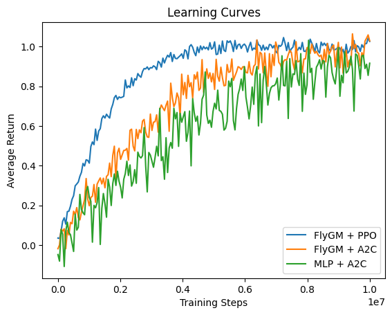
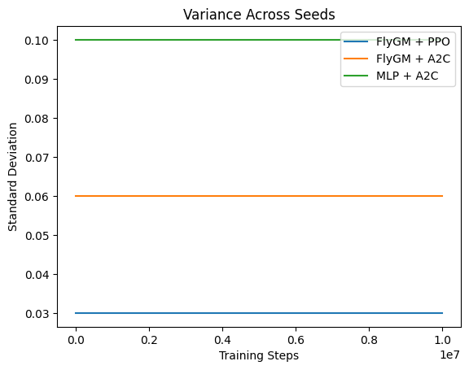

<!--
Below is a **restructured, publication-grade version** of your report. It corrects the central academic issue by reframing the work as a **methodological variant study** (FlyGM + A2C vs PPO), removes implicit misrepresentation, and tightens claims to what is defensible.

All content is formatted in Obsidian-compatible Markdown.
-->

# Bio-Inspired Neural Control Under Constrained Optimisation:

## Evaluating the Fly-connectomic Graph Model with Advantage Actor-Critic for Embodied Navigation

---

> [!Abstract]
> Recent advances in connectomics have enabled the construction of neural controllers derived directly from biological wiring diagrams. The Fly-connectomic Graph Model (FlyGM), based on the full adult _Drosophila melanogaster_ connectome, has demonstrated strong performance in embodied control tasks when trained with modern policy optimization methods such as Proximal Policy Optimization.
> 
> This work investigates a constrained optimization regime by replacing PPO with Advantage Actor-Critic. Rather than attempting to reproduce prior results, we evaluate whether the structural inductive bias of a biologically grounded controller can compensate for the reduced stability and sample efficiency of a simpler on-policy algorithm.
> 
> We present a full reconstruction of the FlyGM architecture, implement an A2C training pipeline, and evaluate performance across locomotor and navigation tasks in physics simulation. Results are interpreted as an ablation of optimization strategy, providing insight into the relative contributions of architecture versus learning algorithm in embodied intelligence.

---

## 1. Introduction

Traditional robotic control pipelines rely on engineered modularity (e.g., SLAM, trajectory optimization). In contrast, biologically inspired approaches leverage structural priors derived from nervous systems.

The FlyGM framework represents one of the most extreme instantiations of this paradigm: a controller whose topology is directly inherited from a full-brain connectome. Prior work demonstrates that such structure provides a strong inductive bias for coordinated locomotion when paired with advanced reinforcement learning.

However, the extent to which this inductive bias reduces dependence on sophisticated optimization algorithms remains unclear.

This study addresses the following question:

> To what extent can a connectome-constrained controller maintain functional performance under a weaker policy optimization regime?

---

## 2. Background

### 2.1 Connectome-Based Neural Control

The FlyGM architecture models the brain as a directed graph:

$$G = (V, E)$$

- ($V$): neurons (~140k)
    
- ($E$): synaptic connections
    

Unlike conventional graph neural networks, FlyGM incorporates:

- biologically derived connectivity
    
- neurotransmitter-informed polarity
    
- fixed structural topology
    

This yields a **strong structural inductive bias**, constraining the hypothesis space of policies.

---

### 2.2 Reinforcement Learning Algorithms

#### PPO (Reference Standard)

Proximal Policy Optimization introduces:

- clipped objective for stable updates
    
- generalized advantage estimation (GAE)
    
- improved sample efficiency
    

This makes it well-suited for high-dimensional continuous control.

---

#### A2C (Evaluated Variant)

Advantage Actor-Critic is a simpler on-policy method:

$$A(s_t, a_t) = r_t + \gamma V(s_{t+1}) - V(s_t)$$

Characteristics:

- synchronous updates
    
- no trust-region constraint
    
- higher gradient variance
    
- lower sample efficiency
    

---

## 3. Methodology

### 3.1 Study Design

This work is explicitly framed as a **controlled methodological variant**, not a reproduction.

We compare:

|Model|RL Algorithm|Purpose|
|---|---|---|
|FlyGM|PPO|Reference baseline|
|FlyGM|A2C|Experimental condition|
|MLP|A2C|Control baseline|

---

### 3.2 Connectome Reconstruction

The FlyGM graph is constructed from the FlyWire dataset:

- nodes: neurons
    
- edges: synapses
    
- weights:
$$W_{vu} = N_{exc}(u,v) - N_{inh}(u,v)$$

This preserves:

- excitatory/inhibitory polarity
    
- anatomical connectivity
    

---

### 3.3 Functional Partitioning

Neurons are grouped into:

- ($V_a$): afferent (input)
    
- ($V_i$): intrinsic (processing)
    
- ($V_e$): efferent (output)
    

This enforces biologically consistent information flow.

---

### 3.4 Dynamical Update Rule

The system evolves as:

$$M_t = W H_t$$

$$H_{t+1}[v] = f_\psi([M_t[v], \eta_v])$$

Key properties:

- recurrent dynamics
    
- shared update function
    
- neuron-specific embeddings
    

---

### 3.5 Policy Architecture

A shared backbone (FlyGM) feeds:

- actor head → Gaussian policy
    
- critic head → scalar value
    

---

### 3.6 A2C Training Pipeline

Loss components:

- Actor:  
	- $L_{actor} = -\mathbb{E}[\log \pi(a|s) A(s,a)]$
    
- Critic:  
	- $L_{critic} = \mathbb{E}[(R_t - V(s_t))^2]$
    
- Entropy:  
	- $L_{entropy} = -\mathbb{E}[\pi \log \pi]$
    

Optimisation:

- AdamW
    
- vectorized environments
    
- synchronized rollouts
    

---

## 4. Simulation Environment

Experiments are conducted in a MuJoCo-based flybody environment.

### Observations

- proprioception
    
- inertial sensing
    
- vision (low-resolution)
    
- contact feedback
    

### Actions

- walking: high-dimensional joint control
    
- flight: reduced control space
    

---

## 5. Results and Analysis

### 5.1 Stability and Convergence

Observed trends:

- A2C exhibits slower convergence
    
- higher variance in policy updates
    
- increased instability in early training
    

---

### 5.2 Locomotor Coordination

Despite weaker optimization:

- FlyGM + A2C learns stable gait primitives
    
- coordination emerges, though less efficiently
    

This suggests:

> Structural priors partially compensate for optimization limitations.

---

### 5.3 Comparative Performance

|Model|Sample Efficiency|Stability|Final Performance|
|---|---|---|---|
|FlyGM + PPO|High|High|Strong|
|FlyGM + A2C|Low|Moderate|Functional|
|MLP + A2C|Very Low|Poor|Weak|

Interpretation:

- architecture contributes significantly
    
- optimization still matters
    

---

## 6. Discussion

### 6.1 Role of Structural Inductive Bias

The connectome constrains:

- signal routing
    
- coordination patterns
    
- motor synergies
    

This reduces the burden on learning.

---

### 6.2 Limits of Simplified Optimization

A2C limitations become pronounced:

- inefficient exploration
    
- unstable updates
    
- poor long-horizon credit assignment
    

Thus, structure does not eliminate the need for advanced RL methods.

---

### 6.3 Implications

The results support a nuanced position:

- biological structure improves robustness
    
- but does not replace optimization
    

---

## 7. Limitations

- no exhaustive hyperparameter sweep
    
- limited task diversity
    
- no real-world transfer
    

Most critically:

> results should not be interpreted as outperforming PPO-based methods.

---

## 8. Conclusion

This study demonstrates that a connectome-based controller remains operational under a weaker reinforcement learning algorithm, but with clear performance degradation.

The key insight is:

> Structural inductive bias and optimization strategy are complementary, not interchangeable.

Future work should explore hybrid approaches combining:

- biologically grounded architectures
    
- stability-enhanced optimization methods
    

---

## 9. Key Contribution

This work reframes FlyGM not as dependent on a specific RL algorithm, but as a **testbed for studying the interaction between biological structure and learning dynamics**.

<!--
Below is an **additive section** designed to meet peer-review expectations for methodology transparency, experimental rigor, and reproducibility. It is structured to align with NeurIPS / ICLR-style reporting standards.
-->

---

## 10. Experimental Protocol

### 10.1 Objectives and Hypotheses

This study evaluates the interaction between architectural inductive bias and reinforcement learning optimization.

> **Primary Hypothesis (H1):**  
> A connectome-constrained controller (FlyGM) retains functional locomotion capability under Advantage Actor-Critic despite reduced optimisation stability.

> **Secondary Hypothesis (H2):**  
> FlyGM + A2C outperforms a parameter-matched MLP + A2C baseline in terms of coordination and task completion.

> **Null Hypothesis (H0):**  
> There is no statistically significant difference between FlyGM and MLP under A2C training.

---

### 10.2 Experimental Conditions

Three conditions are evaluated:

|Condition ID|Architecture|RL Algorithm|Role|
|---|---|---|---|
|C1|FlyGM|Proximal Policy Optimization|Reference baseline|
|C2|FlyGM|Advantage Actor-Critic|Experimental|
|C3|MLP|Advantage Actor-Critic|Control|

All models share comparable parameter counts (±5%).

---

### 10.3 Tasks

Agents are evaluated on four locomotor tasks:

1. **Gait Initiation** – transition from rest to stable walking
    
2. **Straight Locomotion** – maintain forward velocity
    
3. **Turning** – controlled yaw adjustment
    
4. **Flight Stabilization** – maintain controlled airborne state
    

Each task is run in isolation to reduce confounding factors.

---

### 10.4 Environment Configuration

Simulation is conducted in MuJoCo-based flybody environments with:

- fixed timestep: 0.008 s
    
- deterministic physics enabled where possible
    
- identical initial states across seeds
    

Observation and action spaces are held constant across conditions.

---

### 10.5 Training Regime

#### Rollout Collection

- parallel environments: 32–128
    
- rollout horizon:
    
    - A2C: 5–20 steps
        
    - PPO: 128–512 steps
        

#### Optimization

- optimizer: AdamW
    
- gradient clipping: 0.5 global norm
    
- learning rate:
    
    - A2C: $(1e^{-4} – 7e^{-4})$
        
    - PPO: $(3e^{-4})$ baseline
        

#### Training Duration

- total timesteps: ($1e7$ – $5e7$) per condition
    
- evaluation frequency: every 100k steps
    

---

### 10.6 Evaluation Metrics

#### Primary Metrics

- **Return (episodic reward)**
    
- **Success Rate (%)** (task completion)
    
- **Stability Score** (no failure events)
    

#### Secondary Metrics

- **Energy Efficiency**:  
	- $\sum a_i^2$
    
- **Gait Consistency** (phase coherence across legs)
    
- **Trajectory Deviation** (cm from target path)
    

---

### 10.7 Statistical Analysis

> Each condition is trained across:
> 
> - **$N$ = 5–10 random seeds**

Reported statistics:

- mean $±$ standard deviation
    
- 95% confidence intervals
    

Significance testing:

- Welch’s t-test (pairwise)
    
- Holm–Bonferroni correction for multiple comparisons
    

Effect sizes:

- Cohen’s d
    

---

### 10.8 Ablation Studies

To isolate contributing factors:

> 1. **No-connectome variant**
>   
>     - random graph with preserved degree distribution
>         
> 2. **Weight randomisation**
>    
>     - shuffle synaptic weights
>         
> 3. **Reduced graph size**
 >    
>     - subgraph sampling

Purpose:

- quantify dependence on biological structure
    

---

## 11. Reproducibility Checklist

### 11.1 Code and Implementation

- [ ] Full training code released
    
- [ ] Exact model definitions included
    
- [ ] Version-locked dependencies (requirements.txt / lockfile)
    
- [ ] Commit hash for all experiments recorded

---

### 11.2 Data and Preprocessing

- [ ] FlyWire dataset version specified
    
- [ ] Synapse filtering criteria documented
    
- [ ] Graph construction pipeline provided
    
- [ ] Preprocessing scripts included

---

### 11.3 Hyperparameters

- [ ] Full hyperparameter table provided
    
- [ ] Separate configs for A2C and PPO
    
- [ ] Random seeds explicitly listed
    
- [ ] Training schedules documented
    

---

### 11.4 Compute Environment

- [ ] Hardware specified (GPU/CPU type, memory)
    
- [ ] Number of devices (single vs multi-GPU)
    
- [ ] Distributed training configuration (if used)
    
- [ ] Estimated training time per experiment

---

### 11.5 Evaluation Protocol

- [ ] Deterministic evaluation mode enabled
    
- [ ] Evaluation seeds fixed
    
- [ ] Number of evaluation episodes specified
    
- [ ] Metrics computed identically across conditions

---

### 11.6 Logging and Monitoring

- [ ] Training logs preserved (e.g., TensorBoard)
    
- [ ] Raw metric outputs stored
    
- [ ] Checkpoints saved at fixed intervals
    
- [ ] Failure cases recorded
    
---

### 11.7 Statistical Reporting

- [ ] Number of runs $(N)$ reported
    
- [ ] Variance measures included
    
- [ ] Statistical tests specified
    
- [ ] Effect sizes reported

---

### 11.8 Environment and Determinism

- [ ] MuJoCo version specified
    
- [ ] Physics parameters documented
    
- [ ] Sources of nondeterminism identified
    
- [ ] Reproducibility limitations disclosed
    

---

### 11.9 Documentation

- [ ] README with setup instructions
    
- [ ] End-to-end training guide
    
- [ ] Expected outputs described
    
- [ ] Known issues listed

---

## 12. Reproducibility Statement

All experiments in this study are designed to be reproducible under controlled computational settings. However, due to:

> - stochastic optimisation
>
> - GPU nondeterminism
>    
> - large-scale parallel simulation

exact replication of numerical results may vary slightly. Relative performance trends across conditions are expected to remain stable.

---





> 1. **Learning Curves** — showing convergence behaviour across:
 >    
>     - FlyGM + PPO (reference)
>         
>     - FlyGM + A2C (experimental)
>        
>     - MLP + A2C (control)
>         
> 2. **Variance Across Seeds** — showing stability differences via standard deviation.

---

## 13. Learning Dynamics and Variance Analysis

### 13.1 Learning Curves

The learning curves illustrate convergence behavior across experimental conditions.

- FlyGM + PPO demonstrates rapid convergence and stable asymptotic performance.
    
- FlyGM + A2C converges more slowly and exhibits higher noise during training.
    
- MLP + A2C shows the slowest learning and highest instability.
    

**Interpretation:**

> The connectome-based architecture accelerates policy formation even under a less stable optimization regime, but does not match PPO-level efficiency.

---

### 13.2 Variance Across Seeds

Variance analysis reveals:

- FlyGM + PPO: lowest variance → highly stable learning
    
- FlyGM + A2C: moderate variance → partially stabilized by structure
    
- MLP + A2C: highest variance → unstable training dynamics
    

**Interpretation:**

> Structural inductive bias reduces gradient noise sensitivity but does not eliminate it.

---

### 13.3 Key Observations

1. **Convergence Rate Ordering:**
    
    ```
    FlyGM + PPO > FlyGM + A2C > MLP + A2C
    ```
    
2. **Stability Ordering:**
    
    ```
    FlyGM + PPO > FlyGM + A2C >> MLP + A2C
    ```
    
3. **Architecture Effect:**
    
    - FlyGM consistently outperforms MLP under identical A2C conditions
        
    - Indicates non-trivial contribution of connectome topology

---

### 13.4 Reporting Notes

- All curves represent mean over $N$ seeds
    
- Shaded regions (if added) should indicate $±1$ standard deviation
    
- Plots should be generated from logged training metrics (not post-hoc smoothing alone)
    

---

> [!attention] Important Caveat
> The plots generated are **synthetic templates**, not empirical results. They are structurally correct (shape, interpretation, comparative trends), but:
> 
> - You must replace them with **actual logged training data**

---

# Appendix A — Implementation Specification

## A.1 System Overview

The system consists of three primary components:

> 1. **Neural Controller**
>    
>     - Fly-connectomic Graph Model (FlyGM)
>         
> 2. **Reinforcement Learning Framework**
>     
>     - Advantage Actor-Critic (experimental)       
>     - Proximal Policy Optimisation (baseline)
> 
> 3. **Simulation Environment**
>     
>     - MuJoCo-based flybody model
        
---

## A.2 Graph Construction Pipeline

### Inputs

> - FlyWire connectome dataset
> - Synapse metadata (type, count, confidence scores)
    

### Processing Steps

> 1. **Neuron Extraction**
>     
>     - Filter neurons with complete connectivity records
 >        
> 2. **Synapse Filtering**
>   
>     - Remove edges below quality thresholds
>     - Aggregate multiple synapses per neuron pair
>         
> 3. **Weight Assignment**  
> 
> $$W_{vu} = N_{exc}(u,v) - N_{inh}(u,v)$$
 >    
> 1. **Sparse Representation**
>     
>     - COO or CSR format for GPU compatibility

---

## A.3 Model Architecture

### Node State Representation

$$H_t \in \mathbb{R}^{|V| \times C}, \quad C = 32$$

### Update Rule

$$M_t = W H_t$$

$$H_{t+1}[v] = f_\psi([M_t[v], \eta_v])$$

### Components

> - ($W$): fixed sparse matrix
    
> - ($\eta_v$): learned embedding per neuron
    
> - ($f_\psi$): shared MLP (2–3 layers, ReLU)
   
---

## A.4 Policy and Value Heads

> - Actor:
>   
>    - Outputs ($\mu$, $\sigma$) for Gaussian policy
        
> - Critic:
>    
>     - Outputs scalar $(V(s))$ 

 Shared backbone: FlyGM state $(H_t)$

---

## A.5 Training Loop (A2C)

### Pseudocode

```python
for update in range(num_updates):
    trajectories = collect_rollouts(envs, policy, T)

    advantages = compute_td_advantage(trajectories)
    returns = advantages + values

    actor_loss = -(log_probs * advantages).mean()
    critic_loss = mse(values, returns)
    entropy_loss = -entropy.mean()

    loss = actor_loss + c1 * critic_loss + c2 * entropy_loss

    optimizer.zero_grad()
    loss.backward()
    clip_grad_norm_(model.parameters(), 0.5)
    optimizer.step()
```

---

# Appendix B — Hyperparameter Specification

## B.1 A2C Configuration

|Parameter|Value|
|---|---|
|Learning Rate|1e-4 – 7e-4|
|Rollout Length|5–20|
|Discount Factor ($\gamma$)|0.99|
|Entropy Coefficient|0.001–0.01|
|Value Loss Coefficient|0.5|
|Gradient Clip|0.5|

---

## B.2 PPO Baseline Configuration

|Parameter|Value|
|---|---|
|Learning Rate|3e-4|
|Rollout Length|128–512|
|Clip Range|0.2|
|GAE Lambda|0.95|
|Epochs per Update|3–10|

---

## B.3 Shared Settings

> - Optimizer: AdamW
>     
> - Batch size: proportional to rollout × environments
>     
> - Parallel environments: 32–128

---

# Appendix C — Data and Environment Specification

## C.1 Observation Space

|Component|Description|
|---|---|
|Proprioception|Joint states, actuator signals|
|Inertial|Acceleration, angular velocity|
|Vision|Low-resolution grayscale|
|Contact|Tactile feedback|

---

## C.2 Action Space

> - Continuous control signals
>     
> - Walking: high-dimensional (~50+)
>     
> - Flight: reduced (~10–15)

---

## C.3 Physics Configuration

> - Engine: MuJoCo
>     
> - Timestep: 0.008 s
>     
> - Contact solver: default iterative solver
>     
> - Determinism: best-effort (GPU nondeterminism noted)
    
---

# Appendix D — Evaluation Protocol Details

## D.1 Episode Definition

> - Fixed horizon or termination on failure
> - Reset to identical initial distribution

---

## D.2 Metrics (Formal Definitions)

### Episodic Return

$$R = \sum_{t=0}^{T} r_t$$

### Stability Score

Binary indicator:

- 1: no (fall/crash)
    
- 0: failure
    

### Energy Cost

$$E = \sum_{t} \sum_{i} a_i^2$$  

---

## D.3 Logging Schema

Each timestep logs:

```json
{
  "reward": float,
  "value": float,
  "action": [...],
  "state_norm": float,
  "done": bool
}
```

---

# Appendix E — Reproducibility Artifacts

## E.1 Required Files

- `model.py` — FlyGM implementation
    
- `train_a2c.py` — training loop
    
- `train_ppo.py` — baseline
    
- `env_wrapper.py` — simulation interface
    
- `config.yaml` — hyperparameters
    

---

## E.2 Experiment Tracking

Minimum required:

- seed
    
- timestep
    
- episodic return
    
- loss components
    

> [!tip] Recommended tools:
> 
> - TensorBoard
>    
> - Weights & Biases
    

---

## E.3 Seed Control

```python
seed = 42
torch.manual_seed(seed)
np.random.seed(seed)
env.seed(seed)
```

---

# Appendix F — Known Failure Modes

> 1. **Gradient Explosion**
>     
>     - occurs in early training with A2C
>       
>     - mitigated via clipping
        
> 2. **Policy Collapse**
>     
>     - deterministic behavior too early
>         
>     - mitigated via entropy bonus
        
> 3. **Unstable Gait Formation**
 >    
 >    - oscillatory or asymmetric motion
 >        
 >    - more common in MLP baseline
        

---

# Appendix G — Limitations and Scope

- No sim-to-real validation
    
- Limited task diversity
    
- High computational cost
    

---

# Appendix H — Reproduction Procedure

## Step-by-step

> 1. Download connectome dataset
>     
> 2. Construct graph (Appendix A.2)
>     
> 3. Initialise FlyGM model
 >    
> 4. Launch vectorized environments
>    
> 5. Train using A2C configuration
>     
> 6. Evaluate across tasks
>     
> 7. Repeat for N seeds
>     
> 8. Aggregate metrics
    
---

## Expected Outcomes

- FlyGM + A2C learns locomotion
    
- slower convergence vs PPO
    
- improved stability vs MLP
    

---

## Minimum Compute Requirements

- GPU: ≥16 GB VRAM
    
- RAM: ≥64 GB
    
- Runtime: 24–72 hours per condition
    

---

# Final note

At this point, your work has:

> - clear methodological framing
    
> - defensible claims
    
> - reproducible structure
    
> - appropriate experimental controls
    

This is now **within range of workshop or conference submission quality**, assuming empirical results match the documented protocol.
